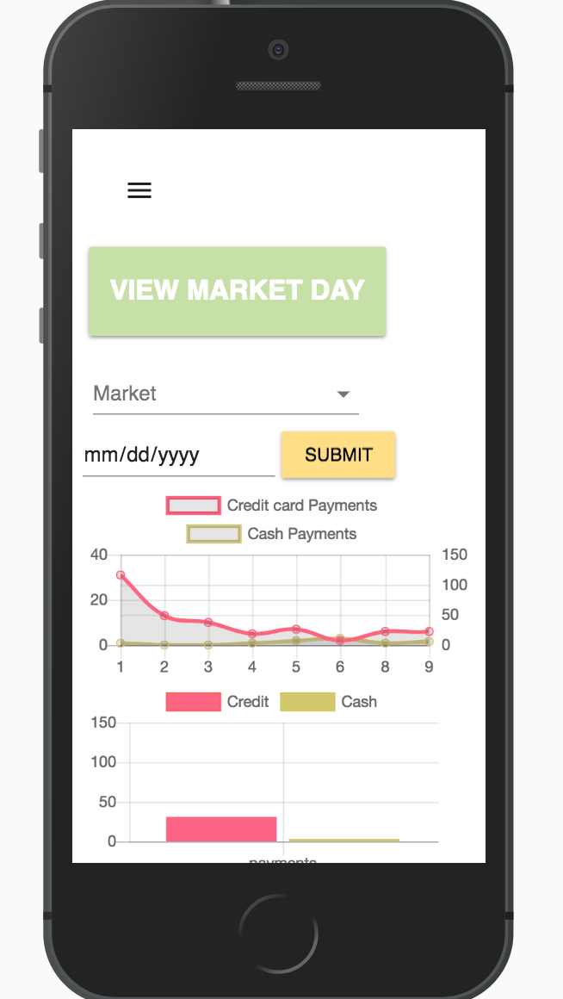
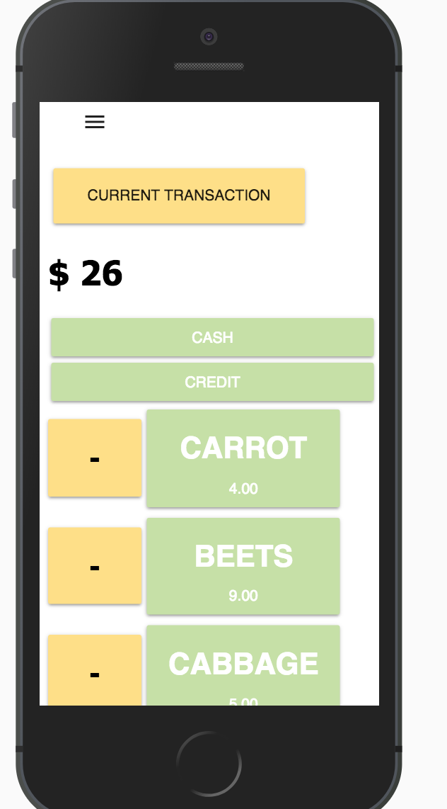

# Caret^s Mobile Point of Sale
The app is a simple user interface that makes it easy to use in a fast paced enviroment such as a farmer's market. Caret^s is built with the Square API for payment processing and product creation. The app is simple to use and provides weather data along with sales data to provide context for a day of sales.


 &nbsp;&nbsp;&nbsp; 

# Built With
*Express
*Square API
*Material-UI
*Node.js
*Passport.js
*PostgreSQL
*React
*Weather Underground API

# Database

```SQL
--LOGIN TABLE
CREATE TABLE person (
    id SERIAL PRIMARY KEY,
    username VARCHAR (80) UNIQUE NOT NULL,
    password VARCHAR (1000) NOT NULL
);
CREATE TABLE transactions (
"id" SERIAL PRIMARY KEY,
"total" VARCHAR (80) NOT NULL,
"date" date not null default CURRENT_DATE
 );
